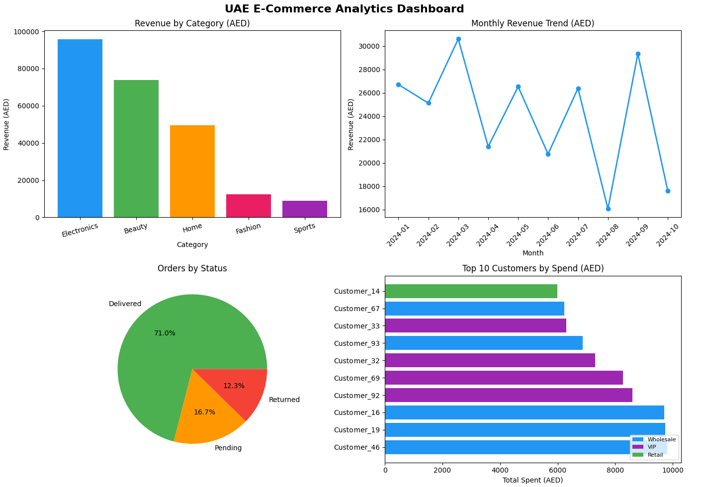
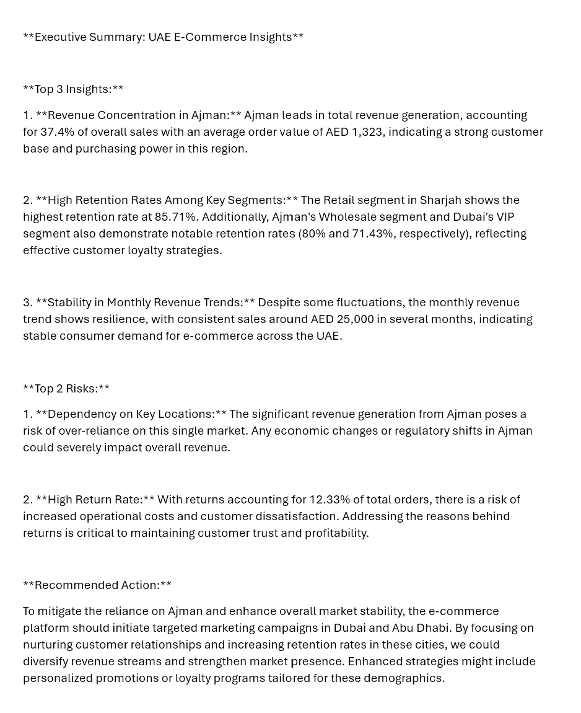

# UAE E-Commerce Analytics — SQL + AI Insights

An end-to-end analytics project built in **Hex** using Python, DuckDB, and OpenAI API.  
Analyzes a synthetic UAE e-commerce dataset across 4 cities, 5 product categories, and 10 months of orders.

---

## Tech Stack

| Tool | Purpose |
|------|---------|
| Hex | Cloud notebook platform |
| Python (pandas, numpy, matplotlib) | Data creation & visualization |
| DuckDB | In-memory SQL engine on pandas dataframes |
| OpenAI API (gpt-4o-mini) | AI-generated executive summary |

---

## Dataset

Synthetically generated using Python/numpy (`seed=42`):

- **Customers** — 100 customers across Dubai, Abu Dhabi, Sharjah, Ajman (Retail, Wholesale, VIP segments)
- **Products** — 20 products across Electronics, Fashion, Home, Beauty, Sports (AED 20–500)
- **Orders** — 300 orders, Jan–Oct 2024 (Delivered 70%, Returned 15%, Pending 15%)

---

## Notebook Structure

| Cell | Description |
|------|-------------|
| 1 | Markdown — Project Overview |
| 2 | Data creation (customers, products, orders) |
| 3 | DuckDB registration |
| 4 | Query 1 — Revenue by category |
| 5 | Query 2 — Top 10 customers by spend |
| 6 | Query 3 — Monthly sales trend |
| 7 | Query 4 — Orders by status (window function) |
| 8 | Query 5 — Customer retention by city & segment (subquery) |
| 9 | Query 6 — Revenue by city |
| 10 | 4-chart matplotlib dashboard |
| 11 | Markdown — Key findings |
| 12 | AI executive summary (OpenAI API) |

---

## Dashboard

---

## AI Executive Summary Sample

---

## Key Findings

- **Electronics** leads revenue at AED 95,680 (40% of total delivered revenue)
- **Ajman** — not Dubai — leads in both customer retention and revenue share (37.4%)
- **Wholesale segment** drives top customer spend — 7 of top 10 customers are Wholesale
- **Return rate at 12.33%** — above the UAE e-commerce benchmark of 8–10%
- **Clear seasonality** — March peak (AED 30,598) vs August low (AED 16,055)

---

## Code

The full notebook code is available in [`notebook.py`](notebook.py).

> Note: Replace `your-api-key-here` in the last cell with your OpenAI API key to run the AI executive summary.

---

## Technical Notes

- DuckDB is pre-installed in Hex — no pip install needed
- OpenAI SDK not available on Hex free plan — used `requests` library instead
- STRFTIME fix required: `STRFTIME('%Y-%m', CAST(order_date AS DATE))`

---

## Author

**Lana Al Maradni**  
Senior Business & Data Analyst | AI-Augmented Analytics  
[LinkedIn](https://www.linkedin.com/in/lanamaradni) • [GitHub](https://github.com/lana-almaradni)